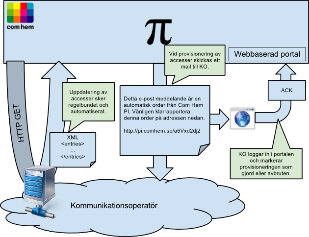

# Provider Interface API V1 (deprecated)

Com Hem PI erbjuder ett API för att automatiskt hämta in accesser från kommunikationsoperatörer. 
Detta sker genom ett HTTP REST / XML API som Com Hem PI anropar för att hämta kommunikationsoperatörens accesser. 

Med "access" menas en unik avlämningspunkt, alltså en port på en access-switch som terminas i exempelvis en lägenhet.

Eftersom det är fördelaktigt att kunna hålla Com Hem PI uppdaterat och "i synk" med kommunikationsoperatören om det aktuella beståndet sker uppdateringsfrågor frekvent. För att detta inte skall belasta KOs servrar inkluderar APIet en begränsningsmekanism.

## Koncept


## Dataformat

<table>
    <tbody>
        <tr>
            <td><strong>Fält</strong></td>
            <td><strong>Förklaring</strong></td>
        </tr>
        <tr>
            <td>
                <code>AccessId</code>
            </td>
            <td>
                Ett, per kommunikationsoperatör, unikt ID på en access.<br>Com Hem förväntar sig att all kommunikation om en avlämningspunkt sker med samma AccessId. Får enbart bestå av tecknen a-z, A-Z, 0-9. <em>text, obligatoriskt, max 32 tecken, [a-zA-Z0-9]+</em>
            </td>
        </tr>
        <tr>
            <td>
                <code>StreetName</code>
            </td>
            <td>
                Gatunamn.<br> I fallet "Kungsgatan 10G" är StreetName "Kungsgatan". <em>text, obligatoriskt</em>
            </td>
        </tr>
        <tr>
            <td>
                <code>StreetNumber</code>
            </td>
            <td>
                Gatunummer.<br> I fallet "Kungsgatan 10G" är StreetNumber "10". <em>16-bit integer</em>
            </td>
        </tr>
        <tr>
            <td>
                <code>StreetLittera</code>
            </td>
            <td>
                Gatubokstav. I fallet "Kungsgatan 10G" är StreetLittera "G". <em>text</em>
            </td>
        </tr>
        <tr>
            <td>
                <code>PostalCode</code>
            </td>
            <td>
                Postnummer. Exempelvis "41369". Min 00000, max 99999. <em>16-bit integer, obligatoriskt</em>
            </td>
        </tr>
        <tr>
            <td>
                <code>City</code>
            </td>
            <td>
                Postort. Exempelvis "Göteborg". <em>text, obligatoriskt</em>
            </td>
        </tr>
        <tr>
            <td>
                <code>CountryCode</code>
            </td>
            <td>
                Landskod. Följer ISO 3166-1 för landskoder. Exempel: "SE" för Sverige. <em>text, ISO 3166-1, obligatoriskt</em>
            </td>
        </tr>
        <tr>
            <td>
                <code>PremisesType</code>
            </td>
            <td>
                PremisesType beskriver avlämningspunktens lokal. <em>obligatoriskt</em>
<dl>
<dt>MDU_APARTMENT</dt><dd>Lägenhet i flerbostadshus. Delad fastighetsbeteckning.</dd>
<dt>MDU_COMMON</dt><dd>Gemensamt utrymme i flerbostadshus. Delad fastighetsbeteckning.</dd>
<dt>RESIDENTIAL_HOUSE</dt><dd>Bostad som har egen fastighetsbeteckning.</dd>
<dt>COMMERCIAL</dt><dd>Lokal, men utan tillträde från allmänheten. Till exempel ett kontor.</dd>
<dt>PUBLIC</dt><dd>Inrättning dit allmänheten har tillträde. Till exempel en restaurang eller ett gym.</dd>
</dl>
            </td>
        </tr>
        <tr>
            <td>
                <code>MduApartmentNumber</code>
            </td>
            <td>
                Lägenhetsnummer enligt Lantmäteriet. En av MduApartmentNumber, MduDistinguisher måste finnas om PremisesType är "MDU_APARTMENT". Exempel: 1101, 0901, 1201, 1213. <em>text, 4 digits, obligatoriskt*</em><br><br>
                Fältet används för att tillsammans med en adress identifiera en unik access. I fallet när kund vill beställa tjänster kan de inte aktiveras hos KO utan att Com Hem har fastställt vilket AccessID kunden har. Genom att unikt identifiera lägenheten med MduApartmentNumber eller MduDistinguisher kan Com Hem fastställa exakt vilken access som skall aktiveras.
            </td>
        </tr>
        <tr>
            <td>
                <code>MduDistinguisher</code>
            </td>
            <td>
                Identifierar lägenheten unikt per adress. En av MduApartmentNumber, MduDistinguisher måste finnas om PremisesType är "MDU_APARTMENT". Exempel är lägenhetsnummer som inte följer Lanmäteriets format: 28 eller 65113. <em>text, obligatoriskt*</em>
            </td>
        </tr>
        <tr>
            <td>
                <code>Activatable</code>
            </td>
            <td>
                Anger när tjänster kan levereras till kunden. Innan dess är de dolda och kan inte beställas. Om tjänsten inte aktiverbar och datumet är okänt kan "NO" användas för att indikera det. Om tjänsten är aktiverbar men datumet är okänt kan "YES" användas för att indikera det. Datumet får tidigast vara 1970-01-01. <em>"YES", "NO" eller ISO-8601 datum (YYYY-MM-DD), obligatoriskt</em><br/>
                <a href="#availability">Se hur sälj- och levererbarhet påverkas.</a><br/>
                <br/>
                Exempel: YES, NO, 2012-07-01
            </td>
        </tr>
        <tr>
            <td>
                <code>Sellable</code>
            </td>
            <td>
                Anger om/när tjänster är köpbara. Innan dess är de dolda och kan inte beställas. Om tjänsten inte är köpbar och datumet är okänt kan "NO" användas för att indikera det. Om tjänsten är köpbar men datumet är okänt kan "YES" användas för att indikera det. Datumet får tidigast vara 1970-01-01. <em>"YES", "NO" eller ISO-8601 datum (YYYY-MM-DD), obligatoriskt</em><br>
                <a href="#availability">Se hur sälj- och levererbarhet påverkas.</a><br/>
                <br/>
                Exempel: YES, NO, 2012-07-01
            </td>
        </tr>
        <tr>
            <td>
                <code>FiberConverter</code>
            </td>
            <td>
                Typ (tillverkare, modell) av Fiber Konverter Switch som "accessen" är kopplad till. <em>text</em>
            </td>
        </tr>
        <tr>
            <td>
                <code>CpeSwitch</code>
            </td>
            <td>
                Om CPEn är en Switch, är detta typen (tillverkare, modell) som är inkopplad. Enbart en av CpeSwitch och CpeRouter får finnas. <em>text</em> 
            </td>
        </tr>
        <tr>
            <td>
                <code>CpeRouter</code>
            </td>
            <td>
                Om CPEn är en Router, är detta typen (tillverkare, modell) som är inkopplad. Enbart en av CpeSwitch och CpeRouter får finnas. <em>text</em> 
            </td>
        </tr>
        <tr>
            <td>
                <code>Option82</code>
            </td>
            <td>
                Fältet används av Com Hem för att korrelera en DHCP förfrågan till en Access. Värdet utgör alltså en nyckel som DHCP, Radius och TR69-servrar använder för att slå upp access-specifik information. Option82 måste vara unikt inom en kommunikationsoperatörs bestånd. <em>text, obligatoriskt</em><br>
                <br/>
                Exempel: "192.168.248.85 ge-0/0/10"<br/>
            </td>
        </tr>
        <tr>
            <td>
                <code>Population</code>
            </td>
            <td>
                Anger delbestånd i hela beståndet. Hela beståndet hämtas alltid in, men det kan filtreras och göras säljbart i olika etapper. <em>text</em>
            </td>
        </tr>
    </tbody>
</table>

## Dataformat - Exempel


Request:
```http
GET /ko/api/1/ HTTP/1.1
```

Response:
```http
HTTP/1.1 200 OK
Last-Modified: Fri, 31 Aug 2012 12:03:28 GMT
Content-Type: application/xml

<?xml version="1.0" encoding="UTF-8" standalone="yes"?>
<Entries>
<Count>1</Count>
<Entry>
    <AccessId>STTA0001</AccessId>
    <Access>
        <StreetName>Testvägen</StreetName>
        <StreetNumber>100</StreetNumber>
        <StreetLittera></StreetLittera>
        <PostalCode>10000</PostalCode>
        <City>Ankeborg</City>
        <CountryCode>SE</CountryCode>
        <PremisesType>MDU_APARTMENT</PremisesType>
        <MduApartmentNumber>1001</MduApartmentNumber>
        <MduDistinguisher>12121212</MduDistinguisher>
        <Activatable>NO</Activatable>
        <Sellable>2012-03-01</Sellable>
        <FiberConverter>LASER_3001X_MK2</FiberConverter>
        <CpeSwitch></CpeSwitch>
        <CpeRouter>NETGEAR WNDR4000</CpeRouter>
        <Option82>192.168.248.85 ge-0/0/10</Option82>
        <Population>Hemsöhem</Population>
    </Access>
</Entry>
</Entries>
```

## Autentisering

PI stöder autentisering via HTTP BASIC. Se [RFC-2617][rfc2617]. När ett icke-tomt användarnamn eller lösenord anges i PI skickas autentiseringssträngen med.

## Begränsningsmekanism

Efter första lyckade anropet kommer anropen att begränsas, på så vis att Com Hem PI bara efterfrågar accesser som förändrats.
Detta sker med HTTP-headern "If-Modified-Since", se [RFC-2616][rfc2616-sec14]. Exemplen använder ingen autentisering.

```
If-Modified-Since = "If-Modified-Since" ":" HTTP-date
```

## Begränsningsmekanism - Exempel

Vid första anropet sker ingen begränsning. Då ber Com Hem PI om fullständiga beståndet.

Request:
```http
GET /ko/api/1/ HTTP/1.1
```

Response:
```http
HTTP/1.1 200 OK
Last-Modified: Fri, 31 Aug 2012 12:03:28 GMT
Content-Type: application/xml
...
```

Vid påföljande anrop skickar Com Hem PI med "If-Modified-Since"-header för att bara be om uppdaterade poster.

Request:
```http
GET /ko/api/1/ HTTP/1.1
If-Modified-Since: Fri, 31 Aug 2012 12:03:28 GMT
...
```

Om det finns uppdaterade poster kan svaret se ut såhär:

Response:
```http
HTTP/1.1 200 OK
Last-Modified: Mon, 03 Sep 2012 09:54:55 GMT
Content-Type: application/xml
```

Om det inte finns uppdaterade poster ser svaret istället ut såhär:

Response:
```
HTTP/1.1 304 Not Modified
Last-Modified: Mon, 03 Sep 2012 09:54:55 GMT
Content-Type: application/xml
```

## <a id="availability"></a> Säljbarhet och Levererbarhet

Fälten "Sellable" och "Activatable" påverkar säljbarheten och levererbarheten på accessen.
Om Sellable eller Activatable saknas betraktas accessen som felaktig och blir inte säljbar.

<table>
    <tbody>
        <tr>
            <td>
                Ej säljstartad och ej leveransklar.
            </td>
            <td>
                <code>(sellable = NO) AND <br/> (now() < activatable OR activatable = NO)</code>
            </td>
        </tr>
        <tr>
            <td>
                Framtida säljstart och ej leveransklar.
            </td>
            <td>
                <code>(now() < sellable) AND <br/> (now() < activatable OR activatable = NO)</code>
            </td>
        </tr>
        <tr>
            <td>
                Säljstartad men ej leveransklar.
            </td>
            <td>
                <code>(sellable <= now() OR sellable = YES) AND <br/> (now() < activatable OR activatable = NO)</code>
            </td>
        </tr>
        <tr>
            <td>
                Säljstartad och leveransklar.
            </td>
            <td>
                <code>(sellable <= now() OR sellable = YES) AND <br/> (activatable <= now() OR activatable = YES)</code>
            </td>
        </tr>
    </tbody>
</table>

[rfc2617]: http://www.ietf.org/rfc/rfc2617.txt "HTTP Authentication: Basic and Digest Access Authentication"
[rfc2616-sec14]: http://www.w3.org/Protocols/rfc2616/rfc2616-sec14.html "HTTP/1.1 RFC-2616 Section 14, Header Field Definitions"
