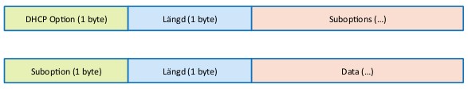
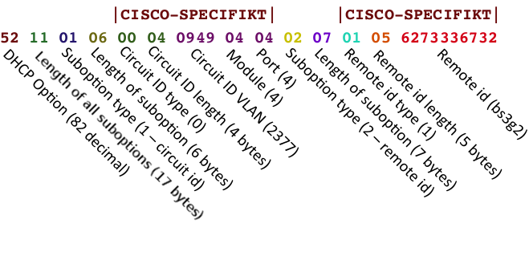

# Feasibility Bulk + Incremental

Com Hem använder Feasibility API för att beskriva vilka accesser/adresser som är säljbara och vilka tjänster som är tekniskt genomförbara. 

## Exempel

Request:
```http
GET /api/2.1/accesses/ HTTP/1.1
```

Response:
```http
HTTP/1.1 200 OK
Last-Modified: Fri, 31 Aug 2012 12:03:28 GMT
Content-Type: application/json

[
    {
        "accessId": "STTA0001", 
        "streetName": "Testvägen", 
        "streetNumber": "100", 
        "streetLittera": "",
        "postalCode": "10000",
        "city": "Ankeborg",
        "countryCode": "SE",
        "premisesType": "MDU_APARTMENT",
        "mduApartmentNumber": "1001", 
        "mduDistinguisher": "12121212", 
        "population": "Hemsöhem",
        "services": [
            {
                "service": "BB-100-100", 
                "connection": "2014-03-01",
                "available": "2014-01-01",
                "serviceType": "BROADBAND",
                "forcedTakeoverPossible": false
            }, {
                "service": "BB-100-10", 
                "connection": "2013-10-12",
                "available": "YES",
                "serviceType": "BROADBAND",
                "forcedTakeoverPossible": false
            }, {
                "service": "BB-10-10", 
                "connection": "2013-10-12",
                "available": "YES",
                "serviceType": "BROADBAND",
                "forcedTakeoverPossible": false               
            }, {
                "service": "IPTV",
                "connection": "2013-10-12",
                "available": "YES",
                "serviceType": "TV",
                "forcedTakeoverPossible": false       
            }, {
                "service": "VOIP", 
                "connection": "2013-08-13", 
                "available": "NO",
                "serviceType": "TELE",
                "forcedTakeoverPossible": true              
            }
        ],
        "active": [
            {
                "service": "BB-100-10",
                "option82": "5216010765746820302F31020B31302E31302E31302E3130",
                "equipment": [
                    { "vendorId": "CH_BROADBAND" }
                ]
            }, {
                "service": "IPTV",
                "option82": "5216010765746820302F32020B31302E31302E31302E3130",
                "equipment": []
            }
        ],
        "coFiberConverter": "LASER_3001X_MK2",
        "coCpeSwitch": "",
        "coCpeRouter": "NETGEAR WNDR4000"
    }
]
```

* Kund har BB-100-10 via Com Hem. Tjänsten är tillgänglig/ledig (för Com Hem). Bredband blir tillgängligt fr.o.m. 2013-10-12.
* Kund har IPTV via Com Hem. Tjänsten är tillgänglig. Tillgängligt fr.o.m. 2013-10-12 (samma som BB)
* BB-10-10 kopplas in 2013-10-12.
* Kund har även VOIP, men inte via Com Hem så det är inte tillgängligt. Kopplades in (tekniskt) 2013-08-13.
* Accessen stödjer BB-100-100 vid senare tidpunkt som övriga tjänster. Tjänsten är tillgänglig fr.o.m. 2014-03-01 (exempelvis p.g.a. en teknisk uppgradering av nätet).
* BB-100-100 behöver patchas om till en ny access-switch. Vid beställning tar det 10 dagar av KO.
* Om KO inte känner till bindningstider utan bara vill indikera att en tjänst är "upptagen" skall Available = NO.
* forcedTakeover är tillgängligt för VOIP eftersom det är upptaget (available: "NO").

## Fältbeskrivningar

* <code>null</code> är inte ett giltigt värde för något fält. 
* Fält markerade med <em>obligatoriskt</em> får inte vara tomma stängen (<code>""</code>)

<table>
    <tbody>
        <tr>
            <td><strong>Fält</strong></td>
            <td><strong>Förklaring</strong></td>
        </tr>
        <tr>
            <td>
                <code>accessId</code>
            </td>
            <td>
                Ett, per kommunikationsoperatör, unikt ID på en access.<br>Com Hem förväntar sig att all kommunikation om en avlämningspunkt sker med samma AccessId. Får enbart bestå av tecknen a-z, A-Z, 0-9. <em>text, obligatoriskt, max 32 tecken, [a-zA-Z0-9]+</em>
            </td>
        </tr>
        <tr>
            <td>
                <code>streetName</code>
            </td>
            <td>
                Gatunamn.<br> I fallet "Kungsgatan 10G" är StreetName "Kungsgatan". <em>text, obligatoriskt</em>
            </td>
        </tr>
        <tr>
            <td>
                <code>streetNumber</code>
            </td>
            <td>
                Gatunummer.<br> I fallet "Kungsgatan 10G" är StreetNumber "10". I fallet "Lantvägen 550-70" är StreetNumber "550". Enbart siffror. <em>text</em>
            </td>
        </tr>
        <tr>
            <td>
                <code>streetLittera</code>
            </td>
            <td>
                Gatubokstav/Uppgång.<br> I fallet "Kungsgatan 10G" är StreetLittera "G". I fallet "Lantvägen 550-70" är StreetLittera "70". <em>text</em>
            </td>
        </tr>
        <tr>
            <td>
                <code>postalCode</code>
            </td>
            <td>
                Postnummer. Exempelvis "41369". Min 10000, max 99999. Alltid fem siffror. <em>text, obligatoriskt</em>
            </td>
        </tr>
        <tr>
            <td>
                <code>city</code>
            </td>
            <td>
                Postort. Exempelvis "Göteborg". <em>text, obligatoriskt</em>
            </td>
        </tr>
        <tr>
            <td>
                <code>countryCode</code>
            </td>
            <td>
                Landskod. Följer ISO 3166-1 för landskoder. Exempel: "SE" för Sverige. <em>text, ISO 3166-1, obligatoriskt</em>
            </td>
        </tr>
        <tr>
            <td>
                <code>premisesType</code>
            </td>
            <td>
                PremisesType beskriver avlämningspunktens lokal. Vid MDU_APARTMENT och MDU_COMMON måste MduDistinguisher eller MduApartmentNumber vara populerade.<em>obligatoriskt</em>
<dl>
<dt>MDU_APARTMENT</dt><dd>Lägenhet i flerbostadshus. Delad fastighetsbeteckning.</dd>
<dt>MDU_COMMON</dt><dd>Gemensamt utrymme i flerbostadshus. Delad fastighetsbeteckning.</dd>
<dt>RESIDENTIAL_HOUSE</dt><dd>Bostad som har egen fastighetsbeteckning.</dd>
<dt>COMMERCIAL</dt><dd>Lokal, men utan tillträde från allmänheten. Till exempel ett kontor.</dd>
<dt>PUBLIC</dt><dd>Inrättning dit allmänheten har tillträde. Till exempel en restaurang eller ett gym.</dd>
<dt>UNKNOWN</dt><dd>Okänd.</dd>
</dl>
            </td>
        </tr>
        <tr>
            <td>
                <code>mduApartmentNumber</code>
            </td>
            <td>
								Lägenhetsnummer enligt Lantmäteriet. Används för att tillsammans med en adress identifiera en unik access. I fallet när kund vill beställa tjänster kan de inte aktiveras hos KO utan att Com Hem har fastställt vilket AccessID kunden har. Genom att unikt identifiera lägenheten med mduApartmentNumber eller mduDistinguisher kan Com Hem fastställa exakt vilken access som skall aktiveras. <em>text, 4 digits, obligatoriskt<sup>1</sup></em><br>
								<br>
								Exempel: 1101, 0901, 1201, 1213.<br>
								<br>
                [1] En av <code>mduApartmentNumber</code>, <code>mduDistinguisher</code> måste finnas om <code>premisesType</code> är <code>"MDU_APARTMENT"</code>.
            </td>
        </tr>
        <tr>
            <td>
                <code>mduDistinguisher</code>
            </td>
            <td>
                Alternativ lokalbeteckning som identifierar lägenheten unikt per adress. Behöver inte följa Lantmäteriets format. <em>text, obligatoriskt<sup>2</sup></em><br>
								<br>
								Exempel: 28, 65113, 1234-1919.<br>
								<br>
	              [2] En av <code>mduApartmentNumber</code>, <code>mduDistinguisher</code> måste finnas om <code>premisesType</code> är <code>"MDU_APARTMENT"</code>.
            </td>
        </tr>
        <tr>
            <td>
                <code>population</code>
            </td>
            <td>
                Anger delbestånd i hela beståndet. Hela beståndet hämtas alltid in, men det kan filtreras och göras säljbart i olika etapper. <em>text</em>
            </td>
        </tr>
        <tr>
            <td>
                <code>services</code>
            </td>
            <td>
                Anger accessens tjänster och feasibility per tjänst. Se fält per tjänst nedan. <br/>
                Oavsett vilken Service Provider som hämtar feasibility-data skall services innehålla samma information.<br/>
                <em>obligatorisk</em><br/>
            </td>
        </tr>
        <tr>
            <td>
                <code>services / service</code>
            </td>
            <td>
                Id/namn på tjänst som avses. Tjänsten kan beställas via Service Activation API. <em>obligatorisk</em>
            </td>
        </tr>
        <tr>
            <td>
                <code>services / serviceType</code>
            </td>
            <td>
                Tjänstetyp. Måste vara en av BROADBAND, TV, TELE. <em>obligatorisk</em>
            </td>
        </tr>
        <tr>
            <td>
                <code>services / connection</code>
            </td>
            <td>
                Anger när accessen kopplas in och den tekniska tjänsten blir aktiverbar första gången. På det angivna datumet, eller om connection är "YES", skall det gå att aktivera tjänster på accessen. <br/>
                Om tjänsten är aktiverbar men datumet är okänt kan "YES" användas för att indikera det. Datumet får tidigast vara 1970-01-01.<br/> 
                <br/>
                <em>"YES", "NO" eller ISO-8601 datum (YYYY-MM-DD), obligatoriskt</em><br/>
                Exempel: YES, NO, 2012-07-01
            </td>
        </tr>
        <tr>
            <td>
                <code>services / available</code>
            </td>
            <td>
                Anger om/när tjänsten är tillgänglig för beställning och leverans. Om tjänsten inte kan levereras, exempelvis på grund av att den är upptagen av annan SP indikeras det med "NO" eller datum då tjänsten blir tillgänglig. Datumet får tidigast vara 1970-01-01.<br/>
                <br/>
                Innan tjänsten är tillgänglig första gången sammanfaller Available och Connection.<br/>
                <br/>
                <em>"YES", "NO" eller ISO-8601 datum (YYYY-MM-DD), obligatoriskt</em><br/>
                Exempel: YES, NO, 2012-07-01
            </td>
        </tr>
        <tr>
            <td>
                <code>services / forcedTakeoverPossible</code>
            </td>
            <td>
                Anger om flaggan "force" i en beställning kommer att ha effekt.<br>
                Alltså, är det möjligt att använda "force" (Forced Takeover) för att KO skall börja leverera Com Hems tjänst istället för annan SPs tjänst. <br>
                Om Forced Takeover inte stöds skall <b>false</b> returneras.<br>
                <em>true eller false, obligatoriskt</em>
            </td>
        </tr>
        <tr>
            <td>
                <code>active</code>
            </td>
            <td>
                Lista över de tjänster som är aktiva på accessen för inloggad SP. <em>obligatorisk</em>
            </td>
        </tr>
        <tr>
            <td>
                <code>active / service</code>
            </td>
            <td>
                Service-namn på den aktiva tjänsten. Skall finnas i "services"-listan. <em>text, obligatoriskt</em><br>
                <br>
                Exempel: "BB-100-10"
            </td>
        </tr>
        <tr>
            <td>
                <code>active / option82</code>
            </td>
            <td>
                Fältet används av Com Hem för att korrelera en DHCP förfrågan till en Access. Värdet utgör alltså en nyckel som DHCP, Radius och TR69-servrar använder för att slå upp access-specifik information. Option82 måste vara unikt inom en kommunikationsoperatörs bestånd. Se <em>text, obligatoriskt</em><br>
                <a href="#option82">Option82 format</a>
                <br>
                Exempel: "5216010765746820302F31020B31302E31302E31302E3130"<br/>
            </td>
        </tr>
        <tr>
            <td>
                <code>active / equipment</code>
            </td>
            <td>
                Lista av utrustning som Com Hem angett för tjänsten.<br>
                Se <a href="service_activation.md">Service Activation</a> för mer information.
            </td>
        </tr>
        <tr>
            <td>
                <code>coFiberConverter</code>
            </td>
            <td>
                Typ (tillverkare, modell) av Fiber Konverter Switch som "accessen" är kopplad till. Skall enbart användas för utrustning som KO tillhandahåller. <em>text</em>
            </td>
        </tr>
        <tr>
            <td>
                <code>coCpeSwitch</code>
            </td>
            <td>
                Om CPEn är en Switch, är detta typen (tillverkare, modell) som är inkopplad. Enbart en av CpeSwitch och CpeRouter får finnas. Skall enbart användas för utrustning som KO tillhandahåller. <em>text</em> 
            </td>
        </tr>
        <tr>
            <td>
                <code>coCpeRouter</code>
            </td>
            <td>
                Om CPEn är en Router, är detta typen (tillverkare, modell) som är inkopplad. Enbart en av CpeSwitch och CpeRouter får finnas. Skall enbart användas för utrustning som KO tillhandahåller. <em>text</em> 
            </td>
        </tr>
    </tbody>
</table>

## Begränsningsmekanism

Com Hem använder If-Modified-Since för att be om inkrementella uppdateringar av accesser. På det viset kan anropet ske ofta men fortfarande vara billigt.

Vid första anropet sker ingen begränsning. Då ber Com Hem PI om fullständiga beståndet. Vid påföljande anrop används If-Modified-Since. Värdet för headern är föregående svars värde på Last-Modified.

Av den anledningen är "Last-Modified" obligatoriskt vid HTTP Status 200.

Se [RFC-2616][rfc2616-sec14]. Exemplen använder ingen autentisering.

```
If-Modified-Since = "If-Modified-Since" ":" HTTP-date
```

## Begränsningsmekanism - Exempel

Exempel på anropssekvens:

Request:
```http
GET /api/2.1/accesses/ HTTP/1.1
```

Response:
```http
HTTP/1.1 200 OK
Last-Modified: Fri, 31 Aug 2012 12:03:28 GMT
Content-Type: application/json
...
```

Vid påföljande anrop skickar Com Hem PI med "If-Modified-Since"-header för att bara be om uppdaterade poster.

Request:
```http
GET /api/2.1/accesses/ HTTP/1.1
If-Modified-Since: Fri, 31 Aug 2012 12:03:28 GMT
...
```

Om det finns uppdaterade poster kan svaret se ut såhär:

Response:
```http
HTTP/1.1 200 OK
Last-Modified: Mon, 03 Sep 2012 09:54:55 GMT
Content-Type: application/json
...
```

Om det inte finns uppdaterade poster ser svaret istället ut såhär:

Response:
```http
HTTP/1.1 304 Not Modified
```

## <a id="option82"></a> Option82 format

Option82-formatet är enligt [RFC-3046][rfc3046-sec2].



Hur suboptions kodas, och vilka som används, är inte standardiserat. För Cisco ser det ut såhär:



I APIt representeras Option82 som en hex-sträng av det binära värdet.

### Exempel:

```
Givet remoteId, circuitId
    remoteId: "10.10.10.10"
    circuitId: "eth 0/1"

Vi använder ascii-tabellen för att få strängen i binär form:
    remoteId: "31302E31302E31302E3130" (11 bytes)
    circuitId: "65746820302F31" (7 byte)

Detta ger i sin tur Option82-värdet 
    "5216010765746820302F31020B31302E31302E31302E3130"

Där:
    52 indikerar Option82
    16 indikerar efterföljande antal bytes (22 bytes)
    01 indikerar start suboption 1
    07 indikerar längd suboption 1
    suboption 1 data (65746820302F31, circuitId)
    02 indikerar start suboption 2
    0B indikerar längd suboption 2 (hex för 11)
    suboption 2 data (31302E31302E31302E3130, remoteId)
```


[rfc2616-sec14]: http://www.w3.org/Protocols/rfc2616/rfc2616-sec14.html "HTTP/1.1 RFC-2616 Section 14, Header Field Definitions"

[rfc3046-sec2]: http://www.ietf.org/rfc/rfc3046.txt "DHCP Relay Agent Information Option"
